# Veterinaria (Laravel)

Software para el proceso de reclamos web orientado a productos de una veterianaria.

### Pre-requisitos 📋 

_Que cosas necesitas para poner en marcha el proyecto y como instalarlos_

* GIT [Link](https://git-scm.com/downloads)
* Entorno de servidor local, Ej: [Laragon](https://laragon.org/download/), [XAMPP](https://www.apachefriends.org/es/index.html) o [LAMPP](https://bitnami.com/stack/lamp/installer).
* PHP Version 7.4 - 8.0 [Link](https://www.php.net/downloads.php).
* Manejador de dependencias de PHP [Composer](https://getcomposer.org/download/).

### Instalación 🔧 

Paso a paso de lo que debes ejecutar para tener el proyecto ejecutandose

 1. Clona el repositorio con el siguiente comando:
    ```bash
    git clone git@github.com:ivanbarboz/veterinaria.git
    ```
 4. Ingresa a la carpeta del repositorio
    ```bash
    cd repositorio
    ```
 5. Instala las dependencias del proyecto
    ```bash
    composer install
    ```

    ```bash
    npm install
    ```
 5. Crea el archivo ".env" copiando la información del ejemplo y cambiar valores de su Base de datos.
 6. Ejecute las migraciones
    ```bash
    php artisan migrate
    ```
 7. Inicialice el servidor local
    ```bash
    php artisan serve
    ```

## Diagrama Entidad - Relación

```mermaid
---
title: Veterinaria
---
erDiagram
    unit {
        int id "Identificador de la unidad"
        varchar(20) nombre "Nombre de la unidad"
    }

    product {
        int id "Identificador del producto"
        varchar(80) nombre "Nombre del producto"
        decimal precio "Precio del producto"
        date fecha_vencimiento "Fecha en la que el producto vence"
    }

    product_unit {
        int product_id "Identificador del producto"
        int unit_id "Identificador de la unidad"
        int current_stock "Cantidad actual del producto"
        int stock "El stock inicial en el ultimo ingreso"
        date last_entry "Fecha del ultimo ingreso del producto con la unidad"
    }

    laboratory {
        int id "Identificador del laboratorio"
        varchar(80) nombre "Nombre del laboratorio"
        varchar(120) ubicacion "Ubicación del laboratorio"
    }

    product_laboratory {
        int product_id 
        int laboratory_id
    }

    document_type {
        int id "Identificador del documento"
        varchar(40) nombre "Nombre del documento"
    }

    user_document {
        int user_id "Identificador del usuario"
        int document_type_id "Identificador del tipo de documento"
        varchar(20) nro_document "Número del documento"
    }

    user {
        int id "Identificador del usuario (Cliente)"
        varchar(120) nombres "Nombres del usuario"
        varchar(120) apellidos "Apellidos del usuario"
        varchar(160) correo "Correo del usuario"
        varchar(1) estado "Estado de la cuenta A (Activado) D (Desactivado)"
    }

    employee {
        int id "Identificador del empleado"
        varchar(120) nombres "Nombres del empleado"
        varchar(120) apellidos "Apellidos del empleado"
        varchar(10) telefono "Número de telefono del empleado"
        varchar(120) correo "Correo del empleado"
        date fecha_nacimiento "Fecha de nacimiento del empleado" 
    }

    employee_document {
        int employee_id "Identificador del empleado"
        int document_type_id "Identificador del tipo de documento"
    }

    purchase {
        int id "Identificador de compra"
        varchar(120) cod_compra "Código de identificación de compra"
        date fecha_compra "Fecha de la compra"
        decimal monto_total "Monto pagado por la compra"
        int user_id "Usuario que realizo la compra"
        int employee_id "Empleado que atendi la compra"
    }

    purchase_product {
        int purchase_id "Identificador de la compra"
        int product_id "Identificador del producto"
        int cantidad "Cantidad del producto por compra"
    }

    claim {
        int id "Identificador del reclamo"
        varchar(255) descripcion "Descripción del reclamo"
        date fecha_respuesta "Fecha en la que se respondio al reclamo"
        varchar(1) modo_respuesta "C (Correo), T (Telefono), L (Legal)"
        varchar(20) cod_compra "Código de la compra"
        int user_id "Indentificador del usuario"
        int product_id "Identificador del producto"
        int employee_id "Identificador del empleado"
    }

    product_laboratory }|--|| laboratory : "fabrica"
    product ||--|{ product_laboratory : "lo fabrican"
    product_unit }|--|| product : "esta disponible"
    unit ||--|{ product_unit : "la tienen disponible"
    
    user ||--|{ user_document : "tiene"
    user_document }|--|| document_type : "lo tienen"

    employee_document }|--|| employee : "tiene"
    document_type ||--|{ employee_document : "lo tienen"

    product ||--|{ purchase_product : "pertenece"
    purchase ||--|{ purchase_product : "contiene"
    employee ||--|{ purchase : "atiende"
    user ||--|{ purchase : "realiza"

    user ||--|{ claim : "realiza"
    employee ||--|{ claim : "atiende"
    claim }|--|| product : "esta en"
```

